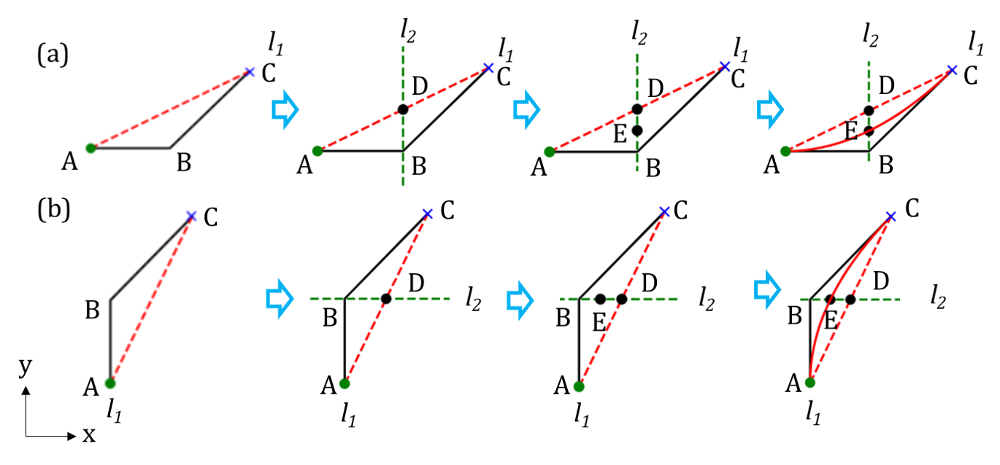

# HKUST_IP_Path_Planning_py
Independent project of HKUST MSc of Mechanical Engineering for path planning of unmanned surface vehicle (USV).

Adapted from the PythonRobotics: https://github.com/AtsushiSakai/PythonRobotics

Featuring path smoother for A* and D* algorithm

Smoothing strategy is as follows

1. Interpolation 1 point between each pair of neighboring waypoints
2. Path smoothing is as follows

